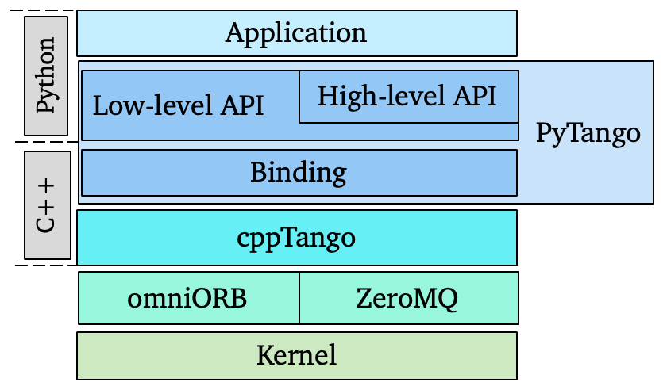
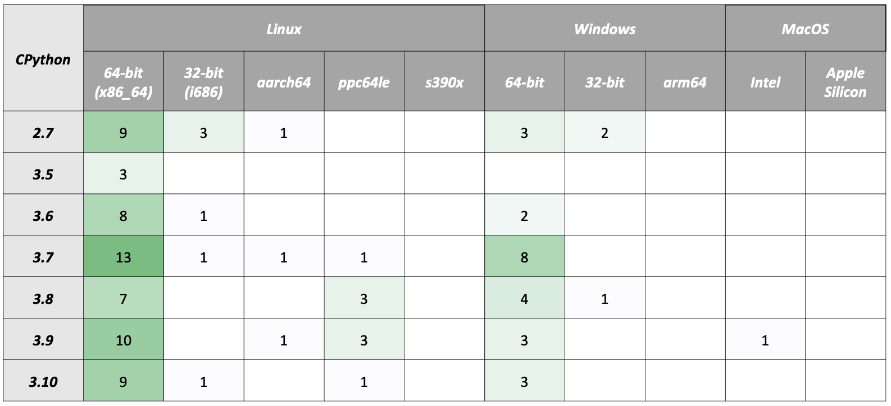
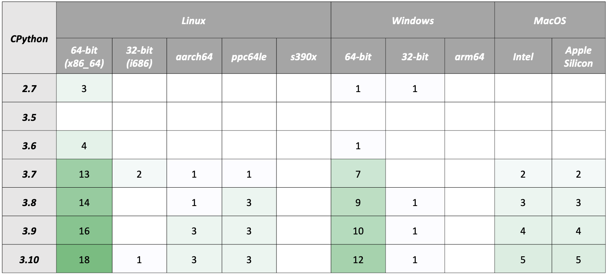
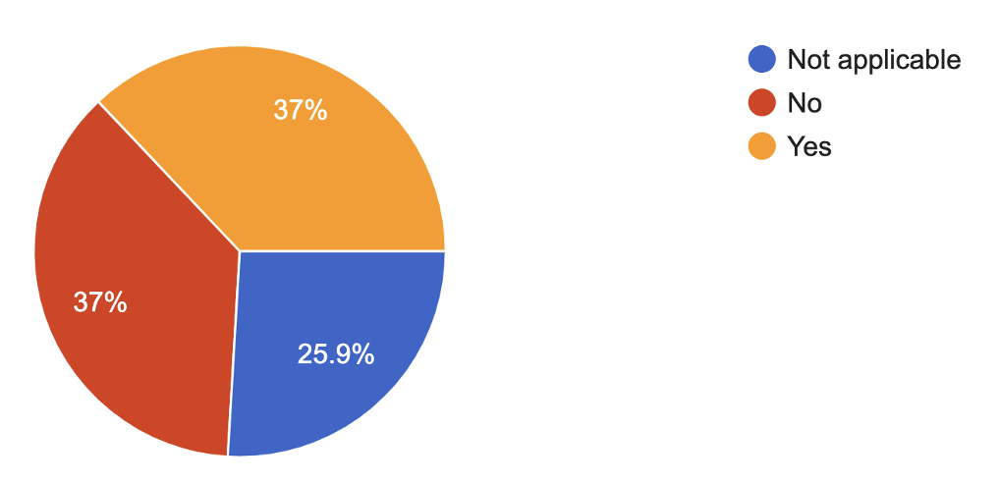
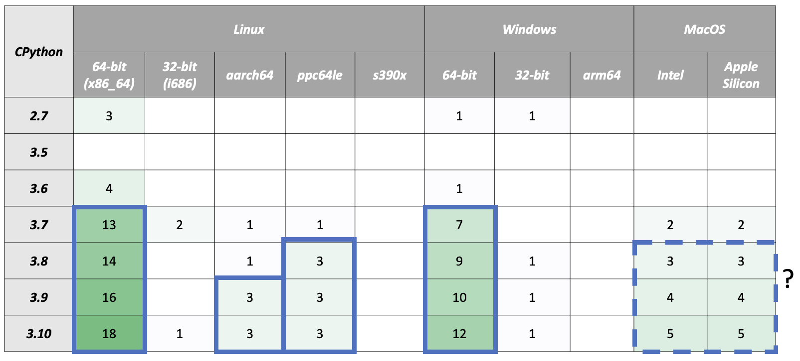
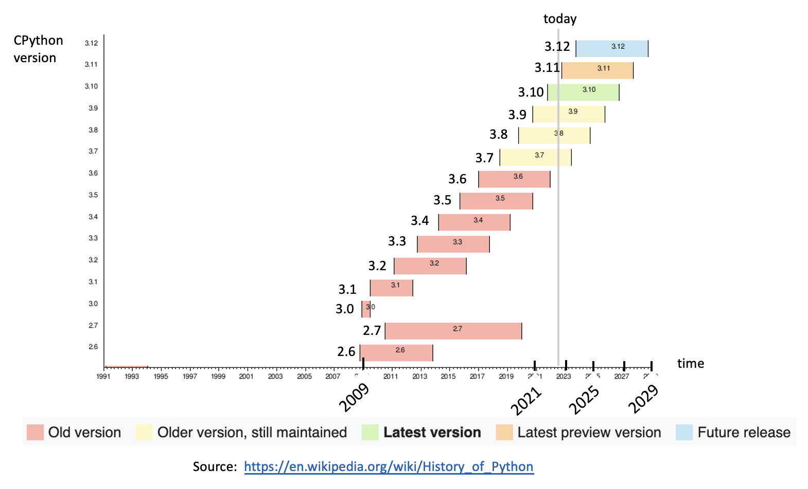

name: empty layout
layout: true

---
name: title
class: center, middle

PyTango Status Report 
=====================

[Anton Joubert](https://gitlab.com/ajoubertza) ([MAX IV](https://www.maxiv.lu.se))

36th Tango Community Meeting

29-30 June 2022

Lund, Sweden

*

GitHub: [ajoubertza/pytango-status-updates](https://github.com/ajoubertza/pytango-status-updates)

Slides: [https://ajoubertza.github.io/pytango-status-updates/](https://ajoubertza.github.io/pytango-status-updates/)

.centre[]


---
name: team
layout: true

New PyTango team member
=======================

---

Welcome to our new team member from DESY!


.center[]

---
name: presentation
layout: true

PyTango?  Quick reminder
========================

---

- Python library

- Binding over the C++ Tango library

- ... using boost-python

- Relies on numpy

- Multi OS: Linux, Windows, MacOS (sort-of)

- Works on Python 2.7, 3.5 to 3.10

.center[]

---

name: releases
layout: true

---
Current release - 9.3.4
==============

###  June 2022

- Usability improvements
- Bugs, memory leak and deadlock fixes
- Documentation and testing improvements
- 34 MRs in total - https://gitlab.com/tango-controls/pytango/-/releases/v9.3.4
- Packages:
  - Source on PyPI
  
  - Windows binary wheels on PyPI
      - Python 2.7, 3.6, 3.7, 3.8 (32-bit + 64-bit)
      - cppTango 9.3.4

  - Conda binary (`pytango` on `conda-forge` channel)
      - Python 3.7, 3.8, 3.9 and 3.10
      - Linux (x86_64) and Windows (64-bit)
      - cppTango 9.3.5

---

### Features/Changes

- Raise when setting non-existent DeviceProxy attr ([!430](https://gitlab.com/tango-controls/pytango/-/merge_requests/430))

```python
>>> proxy = tango.DeviceProxy("test/my/clock")
>>> proxy.get_attribute_list()
['time', 'gmtime', 'noon', 'display', 'State', 'Status']

>>> proxy.display_mode = "DIGITAL"
Traceback (most recent call last):
  File "<stdin>", line 1, in <module>
  File "/opt/conda/envs/env-py3.8-tango9.3.4/lib/python3.8/site-packages/tango/device_proxy.py", line 418, in __DeviceProxy__setattr
    six.raise_from(e, cause)
  File "<string>", line 3, in raise_from
  File "/opt/conda/envs/env-py3.8-tango9.3.4/lib/python3.8/site-packages/tango/device_proxy.py", line 413, in __DeviceProxy__setattr
    raise AttributeError(
AttributeError: Tried to set non-existent attr 'display_mode' to 'DIGITAL'
```

---
### Features/Changes

- Add “friendly” argparser for device server arguments ([!444](https://gitlab.com/tango-controls/pytango/-/merge_requests/444))

Before:
```
user@host:/pytango/examples/Clock# python ClockDS.py --help
usage :  Clock instance_name [-v[trace level]] [-file=<file_name> | -nodb [-dlist <device name list>] ]
```

After:
```
user@host:/pytango/examples/Clock# python ClockDS.py --help
usage: Clock instance_name [-v[trace level]] [-host] [-port] [-file=<file_name> | -nodb [-dlist]]

...
```

---
After:
```
user@host:/pytango/examples/Clock# python ClockDS.py --help
usage: Clock instance_name [-v[trace level]] [-host] [-port] [-file=<file_name> | -nodb [-dlist]]

Instance names defined in database for server Clock:
	bar
	foo
	test

positional arguments:
  instance_name         Device server instance name

optional arguments:
  -h, -?, --help        show this help message and exit
  -v, --verbose         set the trace level. Can be used in count way: -vv or
                        --verbose --verbose
  -vLEVEL               directly set the trace level to LEVEL
  -file FILE_PATH, --file FILE_PATH
                        start device server using an ASCII file instead of the
                        Tango database
  -host HOST, --host HOST
                        Force the host from which server accepts requests
                        (alternatively use ORBendPoint option)
  -port PORT, --port PORT
                        Force the port on which the device server listens
                        (alternatively use ORBendPoint option)

Run device server without database:
  -nodb, --nodb         run server without DB
  -dlist DEV1,DEV2,etc, --dlist DEV1,DEV2,etc
                        The device name list. This option is supported only
                        with the -nodb option.

ORB options (started with -ORBxxx):options directly passed to the underlying ORB. Should be rarely used:
  -ORBendPoint giop:tcp:<host>:<port>, --ORBendPoint giop:tcp:<host>:<port>
                        Specifying the host from which server accept requests
                        and port on which the device server listens.
  -ORB<any_another_option> giop:tcp:<host>:<port>, --ORB<any_another_option> giop:tcp:<host>:<port>
                        Any another ORB option
```

---
### Bug fixes

- Fix read/write/is_allowed not called for dynamic attribute in async mode server ([!401](https://gitlab.com/tango-controls/pytango/-/merge_requests/401))

- Fix Device green_mode usage in MultiDeviceTestContext ([!434](https://gitlab.com/tango-controls/pytango/-/merge_requests/434))

- Fix DeviceProxy constructor reference cycle ([!417](https://gitlab.com/tango-controls/pytango/-/merge_requests/417))

- Release GIL in DeviceProxy and AttributeProxy dtor ([!418](https://gitlab.com/tango-controls/pytango/-/merge_requests/418))

- Allow pipes to be inherited by Device subclasses ([!446](https://gitlab.com/tango-controls/pytango/-/merge_requests/446))
---

### Contributors - thanks!

Alberto López Sánchez, Alejandro Homs Puron, Antonio Bartalesi, Benjamin Bertrand, Blaise Thompson, 
Dantali0n, Emilio Morales, Gavin Burnell, Marc Espín, Mateusz Celary, Yury Matveyev, Stanislaw Cabala,
Thomas Braun, Valentin Valls, Zbigniew Reszela
---
name: upcoming
layout: true

Upcoming release - 9.4.0
========================

---

### Changes

- Drop support for cppTango 9.3.x and add support for cppTango 9.4.x

- C++14 compiler required (for source distribution)

- Drop support for Python 2.7 and 3.5

- Breaking change for spectrum and image attributes

- Require numpy

- Aim for release in November 2022 - closely following cppTango 9.4.0 release

---
### Breaking change to attributes

- Read/writing empty list produces `None` for spectrum and image attributes ([#229](https://gitlab.com/tango-controls/pytango/-/issues/229), [#230](https://gitlab.com/tango-controls/pytango/-/issues/230) from 2018)

```python
class Test(Device):
    value = []

    @attribute(dtype=(int,), max_dim_x=10, access=AttrWriteType.READ)
    def test_read_only(self):
        return []
    
    @attribute(dtype=(int,), max_dim_x=10, access=AttrWriteType.READ_WRITE)
    def test_read_write(self):
        return self.value

    @test_read_write.write
    def test_read_write(self, value):
        self.value = value
```

```python
In [1]: d = Device('my/test/device')
In [2]: str(d.test_read_only)
Out[2]: 'None'  # but changing it to be '[]'
In [3]: str(d.test_read_write)
Out[3]: '[]'
In [4]: d.test_read_write = []
In [5]: str(d.test_read_write)
Out[5]: 'None'  # but changing it to be '[]'
```

---

name: platforms
layout: true

Platform Survey
=============

---

Which platforms do you use PyTango on? [28 responses]

.centre[]
---

Which platforms would you like PyTango binary wheels for? [28 responses]

.centre[]

---

Are you interested in musl libc support (used in Alpine Docker images instead of libc) [27 responses]

.centre[]

---
### Binary wheels on PyPI?

Initial goal:

.centre[]

ABI for Python 3.7: `m`

Skipping Python 3.6, end-of-life was 2021-12-23.

If MacOS works, include Intel and Apple Silicon, from Python 3.8.

musl libc - maybe later.

---

name: compatibility
layout: true

Python version policy
=============

---

Python 3.x is moving quickly, when do we drop support for old versions?  Examples:

- Numpy uses [NEP-29](https://numpy.org/neps/nep-0029-deprecation_policy.html)
- Scikit-HEP (high energy physics) [statement](https://scikit-hep.org/supported-python-versions) 
- Python version in current and previous Debian and Red Hat releases

.centre[]

[//]: # (https://en.wikipedia.org/wiki/Red_Hat_Enterprise_Linux#Product_life_cycle)

[//]: # (https://en.wikipedia.org/wiki/CentOS)

[//]: # (https://en.wikipedia.org/wiki/Debian_version_history)

[//]: # (https://wiki.debian.org/Python)

---

name: development
layout: true

PyTango development
===================

---

### Hosting

- Repo: [gitlab.com/tango-controls/pytango](https://gitlab.com/tango-controls/pytango)

- Docs: [pytango.readthedocs.io](https://pytango.readthedocs.io)

- Continuous Integration:  GitLab CI (Miniconda Docker container), AppVeyor

- Windows packages:  AppVeyor

### Issues

- Questions:  use the [TANGO Forum](https://www.tango-controls.org/community/forum/c/development/python)

- Specific issues:  report on [GitLab](https://gitlab.com/tango-controls/pytango/-/issues) - the more detail the better

---

### Contributing

- Please join in!

- Typical branched Git workflow.  Main branch is `develop` (may change to `main` in future)

- Fork the repo, make it better, make an MR.  Thanks!

- More info in [how-to-contribute](https://pytango.readthedocs.io/en/latest/how-to-contribute.html),
  and the not so recent [webinar](https://www.tango-controls.org/community/news/2021/06/10/4th-tango-kernel-webinar-pytango/)

---
name:  done
class: center, middle
layout: true

Done!  Any questions?
=====================

GitHub: [ajoubertza/pytango-status-updates](https://github.com/ajoubertza/pytango-status-updates)

Slides: [https://ajoubertza.github.io/pytango-status-updates/](https://ajoubertza.github.io/pytango-status-updates/)

.centre[]

---
