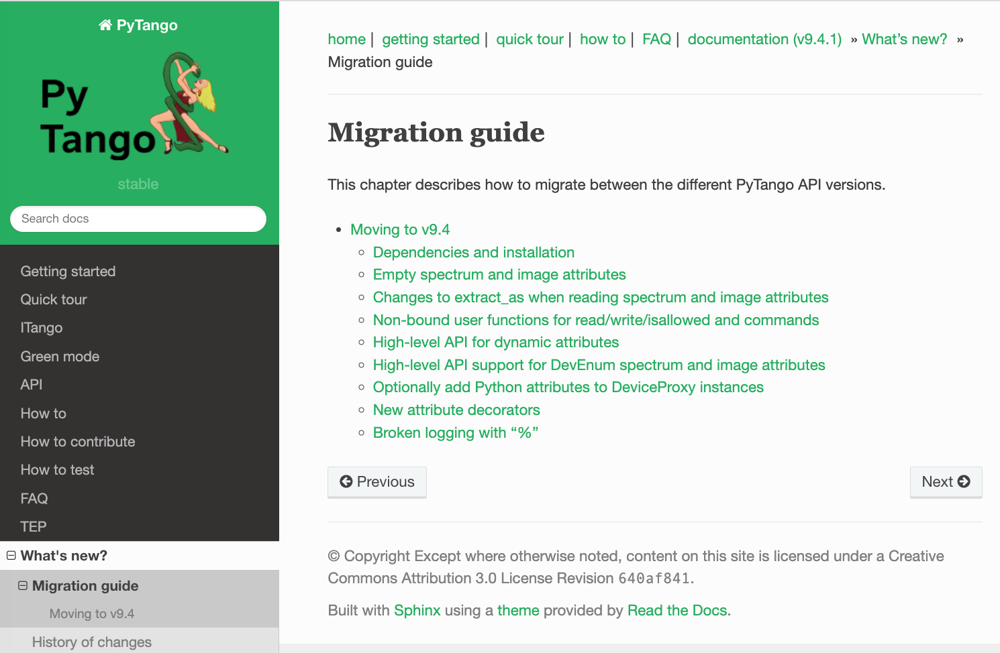
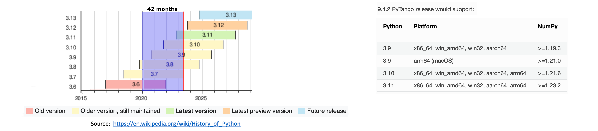

name: empty layout
layout: true

---
name: title
class: center, middle

PyTango Status Report 
=====================

[Anton Joubert](https://gitlab.com/ajoubertza) ([MAX IV](https://www.maxiv.lu.se))


37th Tango Community Meeting

27-29 June 2023

SKAO at Jodrell Bank, Cheshire UK

*

GitHub: [ajoubertza/pytango-status-updates](https://github.com/ajoubertza/pytango-status-updates)

Slides: [https://ajoubertza.github.io/pytango-status-updates/](https://ajoubertza.github.io/pytango-status-updates/)

.centre[]


---
name: ack
layout: true

Acknowledgments
===============

---

Co-maintainer, and contributor to these slides:

[Yury Matveyev](https://gitlab.com/yamatveyev) ([DESY](https://www.desy.de))

---
name: team
layout: true

Growing the team
================

---

Regular attendees of our developers' meetings, which started in September 2022:

- Jose Antonio Ramos Andrades (ALBA)
- Benjamin Bertrand (MAX IV)
- Mateusz Celary (S2Innovation)
- Anton Joubert (MAX IV)
- Thomas Juerges (SKAO)
- Yury Matveev (DESY)
- Jairo Moldes Fuentes (ALBA)
- Mateusz Nabywaniec (S2Innovation)
- Ulrik Pedersen (Observatory Sciences, SKAO)

We meet twice a month - 1st and 3rd Thursdays.  15:00 to 16:00 CET/CEST.

Join the `#pytango` channel on [Tango Controls Slack](https://tango-controls.slack.com/archives/C034P7HLE3U).

Previous meeting minutes: https://gitlab.com/tango-controls/meeting-minutes/pytango

---
name: presentation
layout: true

PyTango?  Quick reminder
========================

---

- Python library

- Binding over the C++ Tango library

- ... using boost-python

- Relies on numpy

- Multi OS: Linux, Windows and macOS

- Python 3.6 to 3.11 (next release 3.9 to 3.11)

.center[]

---

name: releases
layout: true

---
Current release - 9.4.1
==============

###  March 2023

#### "Emergency" release to fix regressions in 9.4.0:
- Regression when applying additional decorators on attribute accessor functions.
- Regression for undecorated read attribute accessor functions in device subclasses.

- Consistent method's signatures for bound and non-bound methods:
  - static Tango attributes:
     - `read_my_attribute(self: MyDevice)`
     - `write_my_attribute(self: MyDevice, value)`

  - dynamic Tango attributes:
     - `read_my_attribute(self: MyDevice, attribute: Attribute | WAttribute)`
     - `write_my_attribute(self: MyDevice, attribute: WAttribute)`

---
### Migration guide

See the new [migration guide](https://pytango.readthedocs.io/en/stable/migration/index.html) for the details of moving to 9.4.x

.center[]

---
Previous release - 9.4.0
==============

###  February 2023

#### Major release with breaking API changes

#### Use 9.4.1, not 9.4.0!  Marked as "yanked" on PyPI.org

Support:

- Python 3.11 added.
- Python 2.7 and Python 3.5 removed.
- Requires at least cppTango 9.4.1.
- Python dependencies:  numpy is no longer optional - it is required.
- macOS!

---
### Bug fixes

- Writing a `numpy.array` to a spectrum attribute of type `str` no longer crashes.

- Reading an enum attribute with `AttrQuality.ATTR_INVALID` quality via the high-level API now returns `None` instead of crashing.
 
- Fixed logging with `%` in the log string and zero arguments.

---

### Features/Changes

- Breaking change to the API when using empty spectrum and image attributes: 

  - Clients reading an empty
  attribute will get an empty sequence (list/tuple/numpy array) instead of a `None` value.
  - Devices that have an empty sequence written will receive it in the write method instead of a `None`
  value.

  - Keep `value` and `w_value` separate when reading attributes:

     - Prior to 9.4.x, the data in the `tango.DeviceAttribute` `value` and `w_value` fields would be concatenated 
     and returned in the `value` field. For a read-only attributes this was reasonable, but not for read-write attributes.

- High-level API support for `DevEnum` spectrum and image attributes.

---

- Added `fisallowed` kwarg for static/dynamic commands and `is_allowed` method for dynamic commands

```python
    from tango.server import Device, command

    class MyDevice(Device):
        _is_allowed = True

        @command(dtype_in=int, dtype_out=int, fisallowed="is_identity_allowed")
        def identity_kwarg_string(self, arg):
            return arg

        def is_identity_allowed(self):
            return self._is_allowed
  ```
---

- Non-bound attribute accessor and `is_allowed` functions:

  ```python
    from tango import AttrWriteType, AttReqType
    from tango.server import Device, command, attribute

    global_data = {"example_attr1": 100}

    def read_example_attr1(device):
        print(f"read from device {device.get_name()}")
        return global_data["example_attr1"]

    def write_example_attr1(device, value):
        print(f"write to device {device.get_name()}")
        global_data["example_attr1"] = value

    def is_example_attr1_allowed(device, req_type):
        print(f"is_allowed attr for device {device.get_name()}")
        assert req_type in (AttReqType.READ_REQ, AttReqType.WRITE_REQ)
        return True

    def is_cmd1_allowed(device):
        print(f"is_allowed cmd for device {device.get_name()}")
        return True

    class MyDevice(Device):
        example_attr1 = attribute(
            fget=read_example_attr1,
            fset=write_example_attr1,
            fisallowed=is_example_attr1_allowed,
            dtype=int,
            access=AttrWriteType.READ_WRITE
        )

        @command(dtype_in=int, dtype_out=int, fisallowed=is_cmd1_allowed)
        def identity1(self, value):
            return value

  ```  

---
Callable classes are also supported:

  ```python
    from tango.server import Device, command


    class IsAllowedCallableClass:

        def __init__(self):
            self._is_allowed = None

        def __call__(self, device):
            return self._is_allowed

        def make_allowed(self, yesno):
            self._is_allowed = yesno

            
    is_allowed_callable = IsAllowedCallableClass()

    
    class MyDevice(Device):
        
        @command(dtype_in=int, dtype_out=int, fisallowed=is_allowed_callable)
        def identity_kwarg_callable_class(self, arg):
            return arg
  ```

---

- Can create attribute with `DevState` as `dtype` instead of literal `"state"`, e.g.:
  ```python
  @attribute(dtype=DevState, access=AttrWriteType.READ)
  ```

- Spectrum/image attributes of `DevState` return `DevState` instances instead of integers:

    ```python
    from tango import DevState
    from tango.server import Device, attribute
    
    class MyDevice(Device):
        @attribute(dtype=(DevState,), max_dim_x=2)
        def my_states(self):
            return [DevState.ON, DevState.OFF]
    
    if __name__ == "__main__":
        MyDevice.run_server()  
    ```  

    ```python
    # old
    >>> dev = tango.DeviceProxy("my/test/device")
    >>> dev.my_states
    array([0, 1], dtype=uint32)
    ```
    ```python
    # new
    >>> dev = tango.DeviceProxy("my/test/device")
    >>> dev.my_states
    (tango._tango.DevState(0), tango._tango.DevState(1))
    ```
  
---
- New attribute decorators for better symmetry with `@<attribute>.setter` and `@<attribute>.write`:
  ```python
  @<attribute>.getter

  @<attribute>.read

  @<attribute>.is_allowed
  ```
Example:
  ```python
    class MyDevice(Device):

        set_voltage = attribute(dtype=float, access=AttrWriteType.READ_WRITE)
        
        @set_voltage.read
        def get_set_voltage(self):
            return SMU.get_set_voltage()
        
        @set_voltage.write
        def set_new_voltage(self, new_voltage):
            SMU.set_voltage(new_voltage)
        
        @set_voltage.is_allowed
        def can_voltage_be_changed(self, req_type):
            if req_type == AttReqType.WRITE_REQ:
                return not SMU.is_ouput_on()
            return True
        
        monitored_voltage = attribute(dtype=float)
        
        @monitored_voltage.getter
        def current_voltage(self):
            return SMU.get_current_voltage()
  ```
---

- (Since 9.3.4, exceptions raised for non-existent Tango attributes via `DeviceProxy`.)
- Developers can optionally allow Python attributes to be added to a `DeviceProxy` instance
  by calling `DeviceProxy.unfreeze_dynamic_interface()`

  ```python
  >>> dev = tango.DeviceProxy('sys/tg_test/1')
  >>> dev.test_attribute = "a"
  Traceback (most recent call last):
    File "/home/matveyev/pytango/tango/device_proxy.py", line 508, in __DeviceProxy__setattr
      raise e from cause
    File "/home/matveyev/pytango/tango/device_proxy.py", line 502, in __DeviceProxy__setattr
      raise AttributeError(
  AttributeError: Tried to set non-existent attr 'test_attribute' to 'a'.
  The DeviceProxy object interface is frozen and cannot be modified - 
  see tango.DeviceProxy.freeze_dynamic_interface for details.
    
  >>> dev.unfreeze_dynamic_interface()
  /home/matveyev/pytango/tango/device_proxy.py:311: UserWarning: 
  Dynamic interface unfrozen on DeviceProxy instance TangoTest(sys/tg_test/1) 
  id=0x7fec1ea137c0 - arbitrary Python attributes can be set without raising an exception.

  >>> dev.test_attribute = "a"
  >>> dev.test_attribute
  'a'
  ```
---

### DevOps Changes

- Run *ruff* Python linter via pre-commit and in CI.

- Use `pyproject.toml` to force numpy installation before build (PEP 518).

- Fix AppVeyor (Windows) compilation with cppTango 9.4.0.

### Other

- Many doc fixes, clarifications and some improved examples.

- Improve `Device` class autocompletion in IDEs.

---

### Packages for 9.4.1
  - Source on PyPI
  
  - Binary wheels on PyPI
      - contain cppTango 9.4.1, omniorb, zmq, etc.
      - Windows:
         - Python 3.6 to 3.11 (32-bit, 64-bit)
      - Linux:
         - Python 3.6 to 3.11 (x86_64, i686, aarch64*)
      - macOS:
          - Python 3.9 to 3.11 (x86_64, arm64)

  - Conda binary (`pytango` on `conda-forge` channel)
      - Python 3.8 to 3.11
      - Linux (x86_64, aarch64), Windows (64-bit), macOS (x86_64, arm64)
      - cppTango 9.4.1
    
`*` aarch64 reports of two bugs in this release, related to omniORB.

More details in [yesterday's talk on packaging](https://indico.tango-controls.org/event/57/contributions/812/).

---
### Summary
- 38 MRs in total - https://gitlab.com/tango-controls/pytango/-/releases/v9.4.0
- 13 MRs in total - https://gitlab.com/tango-controls/pytango/-/releases/v9.4.1

### Contributors since last year - thanks!

Anton Joubert,
Antonio Bartalesi,
Benjamin Bertrand,
Jairo Moldes,
Mateusz Celary,
Michal Liszcz,
Reynald Bourtembourg,
Thomas Juerges,
Ulrik Pedersen,
Yury Matveyev.

---
name: upcoming
layout: true

Upcoming release - 9.4.2
========================

---

### Changes

Implementation of our new [Python and NumPy version policy](https://pytango.readthedocs.io/en/latest/version-policy.html).

*Supported versions are determined based on each PyTango release's anticipated release date, as follows:*

      1. All minor versions of Python released 42 months (3.5 years) prior to that date, and at minimum the two latest minor versions.
      2. All minor versions of NumPy released at that date that meet the requirements in oldest-supported-numpy
         for the corresponding Python version and platform.
As Python minor versions are released annually, this means that PyTango will drop support for the oldest minor Python version every year, and also gain support for a new minor version every year.

.center[]

---

- Fix `DevEncoded` attributes and commands crashes and inconsistency:

  Attributes had a problem with incorrect reference counting and Python's garbage collector.
  Small data might work, but could also be corrupted.  Data > 1MB would segfault.
  
  Solution was to implement data copying for `DevEncoded` attributes, similar to numpy arrays. 
  It may affect performance when sending large datasets, but reliability is more important.

  Commands and attributes API now more consistent: we can write/read str, bytes and bytesarray.
  
  `DevEncoded` data as `str` are decoded as utf-8, not latin-1.
  
- Fixed asyncio server device `State` not changing to ALARM based on attribute `AttrQuality`.

- Raise `UnicodeError` instead of segfaulting when latin-1 encoding fails.

- Fix source location recorded by logging decorators.

- Added CI job to test main cpptango branch weekly.

- Include cppTango 9.4.2 in binary wheels.

---

name: future
layout: true

Future improvements
===================

---

- Type hints for declaring attributes, command and properties.  Under consideration:

    ```python
        host: str = device_property()
  
        @command
        def set_and_get_voltage(self, voltage_to_set: float) -> float:
            hardware.set_voltage(voltage_to_set)
            return hardware.get_voltage()
  
        voltage: float = attribute()
  
        def read_voltage(self):
            return 12.3
    
        current = attribute()
    
        def read_current(self) -> float:
            return 10.5
    ```

- Documentation improvements, after the "write-the-docs" workshop.

- Add `server_init_hook` method to `Device`.

- Explict `AsyncioDevice` class with `async def` methods instead of `green_mode=Asyncio`?

- Support for cppTango 10.0 with IDLv6, and hopefully [OpenTelemetry](https://opentelemetry.io/docs/) tracing.

---

name: development
layout: true

PyTango development
===================

---

### Hosting

- Repo: [gitlab.com/tango-controls/pytango](https://gitlab.com/tango-controls/pytango).

- Docs: [pytango.readthedocs.io](https://pytango.readthedocs.io).

- Continuous Integration:  GitLab CI (Micromamba Docker container), AppVeyor.

- Windows packages:  AppVeyor.

### Release cycle

- At least twice per year.

- Aim for release within 1 month of cppTango releases.

- Release candidates are published - please help us test with your CI!

- Conda Forge packages are sometimes rebuilt to fix problems in dependencies.

---

### Issues

- Questions:  use the [TANGO Forum](https://www.tango-controls.org/community/forum/c/development/python).

- Specific issues:  report on [GitLab](https://gitlab.com/tango-controls/pytango/-/issues) - the more detail the better
  (ideally, example code).


### Contributing

- Please join in!

- Developers' meeting twice a month.

- Typical branched Git workflow.  Main branch is `develop` (may change to `main` in future)

- Fork the repo, make it better, make an MR.  Thanks!

- More info in [how-to-contribute](https://pytango.readthedocs.io/en/latest/how-to-contribute.html),
  and the not so recent [webinar](https://www.tango-controls.org/community/news/2021/06/10/4th-tango-kernel-webinar-pytango/).

---
name:  done
class: center, middle
layout: true

Done!  Any questions?
=====================

GitHub: [ajoubertza/pytango-status-updates](https://github.com/ajoubertza/pytango-status-updates)

Slides: [https://ajoubertza.github.io/pytango-status-updates/](https://ajoubertza.github.io/pytango-status-updates/)

.centre[]

---
