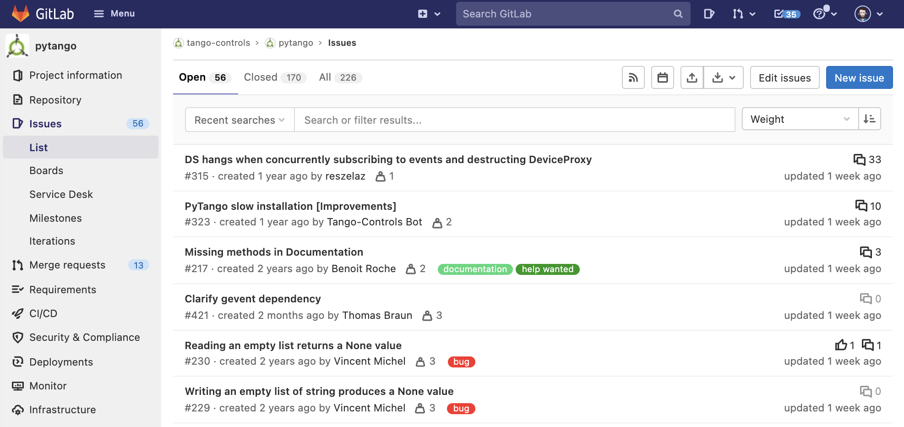

name: empty layout
layout: true

---
name: title
class: center, middle

PyTango Status Report 
=====================

[Anton Joubert](https://gitlab.com/ajoubertza) ([SARAO](https://sarao.ac.za))

35th Tango Community Meeting

Tuesday, 14 September 2021

*

GitHub: [ajoubertza/pytango-status-updates](https://github.com/ajoubertza/pytango-status-updates)

Slides: [https://ajoubertza.github.io/pytango-status-updates/](https://ajoubertza.github.io/pytango-status-updates/)

.centre[]

---

name: presentation
layout: true
class: middle

PyTango?  Quick reminder
========================

---

- Python library

- Binding over the C++ Tango library

- ... using boost-python (future:  pybind11?)

- Relies on numpy

- Multi OS: Linux, Windows, MacOS (sort-of)

- Works on Python 2.7, 3.5 to 3.8, (probably 3.9, 3.10?)

.center[]

---

name: releases
layout: true
class: middle

Current release - 9.3.3
==============

---

###  December 2020

- Fixed Windows binary wheels, and CI now tests on Windows.

- Bugs and memory leak fixes

- Documentation and testing improvements

- Packages:
  - Source on PyPI (works for Linux)
  
  - Windows binary wheels on PyPI (includes cppTango 9.3.4)
  
  - Conda Linux binary (pytango on `conda-forge` channel - not `tango-controls`)

---

name: upcoming
layout: true
class: middle

Upcoming release - 9.3.4
========================

---

### Bugfixes


- Fix DeviceProxy constructor reference cycle ([!417](https://gitlab.com/tango-controls/pytango/-/merge_requests/417))

- tango/pytango_pprint.py: Use correct syntax for comparing object contents ([!424](https://gitlab.com/tango-controls/pytango/-/merge_requests/424))

- _WIP: DS hangs when concurrently subscribing to events and destructing DeviceProxy ([#315](https://gitlab.com/tango-controls/pytango/-/issues/315)).
  Fixed in: Release GIL in DeviceProxy dtor ([!418](https://gitlab.com/tango-controls/pytango/-/merge_requests/418))_

---

### Features/Changes

- Raise when setting non-existent DeviceProxy attr ([!430](https://gitlab.com/tango-controls/pytango/-/merge_requests/430))

```python
>>> proxy = tango.DeviceProxy("test/my/clock")
>>> proxy.get_attribute_list()
['time', 'gmtime', 'noon', 'display', 'State', 'Status']

>>> proxy.display_mode = "DIGITAL"
Traceback (most recent call last):
  File "<stdin>", line 1, in <module>
  File "/opt/conda/envs/env-py3.8-tango9.3.4/lib/python3.8/site-packages/tango/device_proxy.py", line 418, in __DeviceProxy__setattr
    six.raise_from(e, cause)
  File "<string>", line 3, in raise_from
  File "/opt/conda/envs/env-py3.8-tango9.3.4/lib/python3.8/site-packages/tango/device_proxy.py", line 413, in __DeviceProxy__setattr
    raise AttributeError(
AttributeError: Tried to set non-existent attr 'display_mode' to 'DIGITAL'
```

---

### CI improvements

- Enable CI/CD in Gitlab ([!409](https://gitlab.com/tango-controls/pytango/-/merge_requests/409))

- Build and upload source distribution to pypi ([!411](https://gitlab.com/tango-controls/pytango/-/merge_requests/411))

### Development/Testing improvements

- _WIP:  Enable short-name access to `TestContext` devices ([!388](https://gitlab.com/tango-controls/pytango/-/merge_requests/388))_

---

### Documentation improvements

- Fix docs - missing `DbDevExportInfos` and `DbDevImportInfos` ([!406](https://gitlab.com/tango-controls/pytango/-/merge_requests/406))

- Typo on Sphinx documentation ([!404](https://gitlab.com/tango-controls/pytango/-/merge_requests/404))

- Replace github links ([!410](https://gitlab.com/tango-controls/pytango/-/merge_requests/410))

- Fix broken link: no `s` in `gevent` ([!420](https://gitlab.com/tango-controls/pytango/-/merge_requests/420))

- Uncomment docs of `tango.Util.instance()` and build docs for other static methods ([!422](https://gitlab.com/tango-controls/pytango/-/merge_requests/422))

- Fixed arguments name when calling command decorator ([!426](https://gitlab.com/tango-controls/pytango/-/merge_requests/426))

- Fixed variables name in a `tango.Database.add_server` method example ([!427](https://gitlab.com/tango-controls/pytango/-/merge_requests/427))

- Add training material examples ([!429](https://gitlab.com/tango-controls/pytango/-/merge_requests/429))

---

### Build improvements

- Fix deprecated warning with numpy 1.20 ([!414](https://gitlab.com/tango-controls/pytango/-/merge_requests/414))

- Use numpy parallel compilation if available ([!423](https://gitlab.com/tango-controls/pytango/-/merge_requests/423))

- Fix some and silence some C++ compiler warnings ([!425](https://gitlab.com/tango-controls/pytango/-/merge_requests/425))

---

### Contributors - thanks!

vallsv, catunlock, beenje, matcelary, untzag, reszelaz, t-b, marc2332

### When can I get it?

- Before the end of 2021.  Hopefully sooner.  Needs ([!418](https://gitlab.com/tango-controls/pytango/-/merge_requests/418)) to be completed.  

---
name: Future
layout: true
class: middle

Breaking change to fix things?
======

---
- Read/writing empty list produces `None` for spectrum and image attributes ([#229](https://gitlab.com/tango-controls/pytango/-/issues/229), [#230](https://gitlab.com/tango-controls/pytango/-/issues/230) from 2018)

```python
class Test(Device):

    @attribute(dtype=(int,), max_dim_x=10, access=AttrWriteType.READ)
    def test_read_only(self):
        return []

    value = []
    
    @attribute(dtype=(int,), max_dim_x=10, access=AttrWriteType.READ_WRITE)
    def test_read_write(self):
        return self.value

    @test_read_write.write
    def test_read_write(self, value):
        self.value = value
```

```python
In [1]: d = Device('my/test/device')
In [2]: str(d.test_read_only)
Out[2]: 'None'  # but want it to be '[]'
In [3]: str(d.test_read_write)
Out[3]: '[]'
In [4]: d.test_read_write = []
In [5]: str(d.test_read_write)
Out[5]: 'None'  # but want it to be '[]'
```

---

### Poll

1. Yes, please fix it in 9.3.x!
2. Yes, please fix it, but only in 9.4.x.
3. No, don't fix it.  I depend on this, and can't update my code.
4. I'm happy with anything.

---

name: compatibility
layout: true
class: middle

Compatibility Roadmap
=============

---

### PyTango and cppTango

Currently, match _major.minor_ releases when compiling PyTango binding.

cppTango 9.3.x and 9.4.x not Application Binary Interface (ABI) compatible.

Planned compatibility:
```
         cppTango | PyTango | Works?
        ----------|---------|-------
            9.3.x |   9.3.x | yes
            9.3.x |   9.4.x | maybe*
            9.4.x |   9.4.x | yes
```

_* Tested alpha release of cppTango 9.4.x with PyTango 9.3.x.
Tests passed, with only change: `libtango.so.9` ->`libtango.so.94`._

---

### Poll

1. I'm happy if PyTango 9.4.x only supports cppTango 9.4.x.
2. It would be nice if PyTango 9.4.x supports cppTango 9.3.x and 9.4.x.
3. I absolutely need PyTango 9.4.x to support cppTango 9.3.x and 9.4.x.
5. I'm happy with anything.

---

name: pybind11
layout: true
class: middle

pybind11
======

---

### Current status

- No progress since last year, and no plans to work on it in the short term.

- Boost.Python is still actively maintained, and libboost is still included in new Linux distributions (e.g., 1.74 in Debian bullseye).

- Code is on pytango [pybind11](https://gitlab.com/tango-controls/pytango/-/tree/pybind11) branch.

- See previous [status report](https://github.com/ajoubertza/pytango-status-updates/blob/2020-11/slideshow.md#pybind11).

---

name: development
layout: true
class: middle

PyTango development
===================

---

### Hosting

- Repo: [gitlab.com/tango-controls/pytango](https://gitlab.com/tango-controls/pytango)

- Docs: [pytango.readthedocs.io](https://pytango.readthedocs.io)

- Continuous Integration:  GitLab CI (Miniconda Docker container), AppVeyor

- Windows packages:  AppVeyor

### Issues

- Questions:  use the [TANGO Forum](https://www.tango-controls.org/community/forum/c/development/python)

- Specific issues:  report on [GitLab](https://gitlab.com/tango-controls/pytango/-/issues) - the more detail the better

---

### Priority

New approach being trialled.

- Issue priority now indicated via `weight` field.  1 is highest.

- To request changes to priority, contact your Tango steering committee representative or a kernel developer.

.centre[]

---

### Contributing

- Please join in!

- Typical branched Git workflow.  Main branch is `develop`

- Fork the repo, make it better, make an MR.  Thanks!

- More info in [how-to-contribute](https://pytango.readthedocs.io/en/latest/how-to-contribute.html),
  and the recent [webinar](https://www.tango-controls.org/community/news/2021/06/10/4th-tango-kernel-webinar-pytango/)

---
name:  done
class: center, middle
layout: true

Done!  Any questions?
=====================

GitHub: [ajoubertza/pytango-status-updates](https://github.com/ajoubertza/pytango-status-updates)

Slides: [https://ajoubertza.github.io/pytango-status-updates/](https://ajoubertza.github.io/pytango-status-updates/)

.centre[]
---
