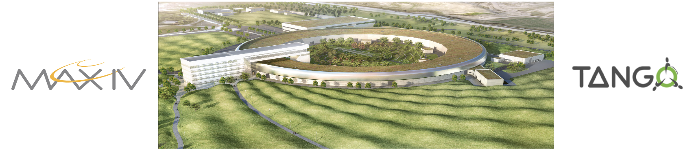

name: empty layout
layout: true

---
name: title
class: center, middle

PyTango Status Report 
=====================

[Anton Joubert](https://gitlab.com/ajoubertza) ([MAX IV](https://www.maxiv.lu.se))

36th Tango Community Meeting

29-30 June 2022

Lund, Sweden

*

GitHub: [ajoubertza/pytango-status-updates](https://github.com/ajoubertza/pytango-status-updates)

Slides: [https://ajoubertza.github.io/pytango-status-updates/](https://ajoubertza.github.io/pytango-status-updates/)

.centre[]


---
name: team
layout: true

New PyTango team member
=======================

---

Welcome to our new team member from DESY!

.center[]

.center[]

---
name: presentation
layout: true

PyTango?  Quick reminder
========================

---

- Python library

- Binding over the C++ Tango library

- ... using boost-python

- Relies on numpy

- Multi OS: Linux, Windows, MacOS (sort-of)

- Works on Python 2.7, 3.5 to 3.10

.center[]

---

name: releases
layout: true

---
Current release - 9.4.1
==============

###  March 2022

#### "Emergency" release to fix breaking change in 9.4.0:
- Regression for undecorated read attribute accessor functions in derived device classes
- Regression when applying additional decorators on attribute accessor functions

- Now all method's signatures should be the same for bounded and non-bounded methods:

  - static attributes:
   
  read_attribute(device_instance)

  write_attribute(device_instance, value)

  - dynamic attributes:
  
  read_attribute(device_instance, attribute)

  write_attribute(device_instance, attribute)

### DevOps Changes

- Run black on repo and add to pre-commit-config
  
  Python code formatter

---
Previous release - 9.4.0
==============

###  February 2022

#### Now mark as "stale". Major release with API breaking changes.

- Python 3.11 support.
- Support for Python 2 and Python 3.5 was removed
- PyTango requires at least cppTango 9.4.1
- Python dependencies:  numpy is no longer optional - it is required.
- MacOS support

### Bug fixes
- Breaking change to the API when using empty spectrum and image attributes. 

  Clients reading an empty
  attribute will get an empty sequence (list/tuple/numpy array) instead of a `None` value.  Similarly,
  devices that have an empty sequence written will receive that in the write method instead of a `None`
  value.

- Keep value and w_value separate

  Prior to 9.4.x, the data in the tango.DeviceAttribute value and w_value fields would be concatenated (respectively) 
  and returned in the value field. For a read-only attributes this was reasonable, but not for read-write attributes.

- Writing a `numpy.array` to a spectrum attribute of type `str` no longer crashes.
- Reading an enum attribute with `AttrQuality.ATTR_INVALID` quality via the high-level API now returns `None` instead of crashing.

- High-level API support for DevEnum spectrum and image attributes
  
- Broken logging with “%” fixed

---

### Features/Changes

- Added fisallowed kwarg for static/dynamic commands and is_allowed method for dynamic commands

  ```python
    class TestDevice(Device):

        def __init__(self, *args, **kwargs):
            super(TestDevice, self).__init__(*args, **kwargs)
            self._is_allowed = True

        @command(dtype_in=int, dtype_out=int)
        def identity(self, arg):
            return arg


        @command(dtype_in=int, dtype_out=int, fisallowed="is_identity_allowed")
        def identity_kwarg_string(self, arg):
            return arg

        def is_identity_allowed(self):
                return self._is_allowed
  ```
  
  ```python
    def non_bound_sync_allowed():
        return is_allowed
      
    class TestDevice(Device):
        
        @command(dtype_in=int, dtype_out=int, fisallowed=non_bound_sync_allowed)
        def identity_kwarg_callable(self, arg):
            return arg
  ```  

  ```python
    class IsAllowedCallableClass:

        def __init__(self):
            self._is_allowed = None

        def __call__(self, device):
            return self._is_allowed

        def make_allowed(self, yesno):
            self._is_allowed = yesno

    is_allowed_callable_class = IsAllowedCallableClass()
      
    class TestDevice(Device):
        
        @command(dtype_in=int, dtype_out=int, fisallowed=is_allowed_callable_class)
        def identity_kwarg_callable_class(self, arg):
            return arg
  ```
  
- State attribute returns DevStates instance
 
  ```python
  >>> dev = tango.DeviProxy('sys/tg_test/1')
  >>> dev.State()
  tango._tango.DevState.RUNNING
  >>> type(dev.State)
  <class 'tango._tango.DevState'>
  ```

  Additionally, there was an option added to create attribute with DevState as dtype, e.g.:
  ```python
  @attribute(dtype=(DevState,), access=AttrWriteType.READ, max_dim_x=2)
  ```
  
- New attribute decorators
  ```python
  @<attribute>.getter

  @<attribute>.read

  @<attribute>.is_allowed
  ```
  
  ```python
  class TestDevice(Device):

    set_voltage = attribute(dtype=float, access=AttrWriteType.READ_WRITE)
  
    @set_voltage.read
    def get_set_voltage(self):
        return SMU.get_set_voltage()
  
    @set_voltage.write
    def set_new_voltage(self, new_voltage):
        SMU.set_voltage(new_voltage)
  
    @set_voltage.is_allowed
    def can_voltage_be_changed(self, req_type):
        if req_type == AttReqType.WRITE_REQ:
            return not SMU.is_ouput_on()
        return True
  
    monitored_voltage = attribute(dtype=float)
  
    @monitored_voltage.getter
    def current_voltage(self):
        return SMU.get_current_voltage()
  ```
  
- Developers can optionally allow Python attributes to be added to a `DeviceProxy` instance
  by calling `DeviceProxy.unfreeze_dynamic_interface`

  ```python
  >>> dev = tango.DeviProxy('sys/tg_test/1')
  >>> dev.test_attribute = "a"
  Traceback (most recent call last):
    File "/home/matveyev/pytango/tango/device_proxy.py", line 508, in __DeviceProxy__setattr
      raise e from cause
    File "/home/matveyev/pytango/tango/device_proxy.py", line 502, in __DeviceProxy__setattr
      raise AttributeError(
  AttributeError: Tried to set non-existent attr 'test_attribute' to 'a'.
  The DeviceProxy object interface is frozen and cannot be modified - 
  see tango.DeviceProxy.freeze_dynamic_interface for details.
    
  >>> dev.unfreeze_dynamic_interface()
  /home/matveyev/pytango/tango/device_proxy.py:311: UserWarning: 
  Dynamic interface unfrozen on DeviceProxy instance TangoTest(sys/tg_test/1) 
  id=0x7fec1ea137c0 - arbitrary Python attributes can be set without raising an exception.

  >>> dev.test_attribute = "a"
  >>> dev.test_attribute
  'a'
  ```
           
---

- 38 MRs in total - https://gitlab.com/tango-controls/pytango/-/releases/v9.4.0
- Packages:
  - Source on PyPI
  
  - Windows binary wheels on PyPI
      - Python 3.6, 3.7, 3.8, 3.9, 3.10, 3.11 (32-bit + 64-bit)
      - cppTango 9.4.1

  - Conda binary (`pytango` on `conda-forge` channel)
      - Python 3.7, 3.8, 3.9 and 3.10
      - Linux (x86_64) and Windows (64-bit)
      - cppTango 9.4.1

---

### DevOps Changes

- Run ruff via pre-commit

  Python linter, which supports over 500 lint rules, many of which are inspired by popular tools like Flake8, isort, pyupgrade, and others

- pyproject.toml to force numpy installation before build (PEP 518) 

### Contributors - thanks!

  Anton Joubert, Benjamin Bertrand, Drew Devereux, Jan David Mol, Jean-Luc PONS, Nicolas Leclercq, Thomas Braun, Vincent Michel, Yury Matveyev
---
name: upcoming
layout: true

Upcoming release - 9.4.2
========================

---

### Changes

- Implementation of Python and NumPy version policy
- 
  Supported versions are determined based on each PyTango release's anticipated release date, as follows:

  1. All minor versions of Python released 42 months prior to that date, and at minimum the two latest minor versions.
  2. All minor versions of NumPy released at that date that meet the requirements in oldest-supported-numpy for the corresponding Python version and platform.

  As Python minor versions are released annually, this means that PyTango will drop support for the oldest minor Python version every year, and also gain support for a new minor version every year.

For example, a 9.4.2 PyTango release would support:

| Python | Platform | NumPy    |
|--------| --- |----------|
| 3.9    | x86_64, win_amd64, win32, aarch64 | >=1.19.3 |
| 3.9    | arm64 (macOS) | >=1.21.0 |
| 3.10   | x86_64, win_amd64, win32, aarch64, arm64 | >=1.21.6 |
| 3.11   | x86_64, win_amd64, win32, aarch64, arm64 | >=1.23.2 |

- Fix DevEncoded attributes and commands

  The origin of these problems is that for DevEncoded attributes we passed data as a ref, 
  but we do not notify python's garbage collector, that object is still needed, 
  so it deallocates memory as soon as we get out of scope. 
  If we send a small data - it just may result in corrupted data
  but if data > 1 Mb and memory was allocated from heap - we get instantly segfault
  
  So we decided to implement data copying also for DevEncoded attributes. 
  It will affect performance, when somebody will try to send big dataset, but make it reliable.

  Also DevEncoded commands and attributes made symmetrical: we can write/read str, bytes and bytesarray.
  
  Strings are decoded as utf-8!
  
- Asyncio server doesn't change state to ALARM with AttrQuality fixed

- Raise UnicodeError instead of segfaulting when Latin-1 encoding fails

---

name: platforms
layout: true

Platform Survey
=============

---

Which platforms do you use PyTango on? [28 responses]

.centre[]
---

Which platforms would you like PyTango binary wheels for? [28 responses]

.centre[]

---

Are you interested in musl libc support (used in Alpine Docker images instead of libc) [27 responses]

.centre[]

---
### Binary wheels on PyPI?

Initial goal:

.centre[]

ABI for Python 3.7: `m`

Skipping Python 3.6, end-of-life was 2021-12-23.

If MacOS works, include Intel and Apple Silicon, from Python 3.8.

musl libc - maybe later.

---

name: compatibility
layout: true

---

name: development
layout: true

PyTango development
===================

---

### Hosting

- Repo: [gitlab.com/tango-controls/pytango](https://gitlab.com/tango-controls/pytango)

- Docs: [pytango.readthedocs.io](https://pytango.readthedocs.io)

- Continuous Integration:  GitLab CI (Miniconda Docker container), AppVeyor

- Windows packages:  AppVeyor

### Issues

- Questions:  use the [TANGO Forum](https://www.tango-controls.org/community/forum/c/development/python)

- Specific issues:  report on [GitLab](https://gitlab.com/tango-controls/pytango/-/issues) - the more detail the better

---

### Contributing

- Please join in!

- Typical branched Git workflow.  Main branch is `develop` (may change to `main` in future)

- Fork the repo, make it better, make an MR.  Thanks!

- More info in [how-to-contribute](https://pytango.readthedocs.io/en/latest/how-to-contribute.html),
  and the not so recent [webinar](https://www.tango-controls.org/community/news/2021/06/10/4th-tango-kernel-webinar-pytango/)

---
name:  done
class: center, middle
layout: true

Done!  Any questions?
=====================

GitHub: [ajoubertza/pytango-status-updates](https://github.com/ajoubertza/pytango-status-updates)

Slides: [https://ajoubertza.github.io/pytango-status-updates/](https://ajoubertza.github.io/pytango-status-updates/)

.centre[]

---
